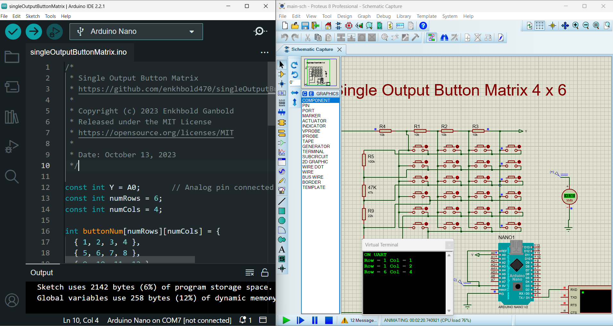

# Single Output Button Matrix


This repository contains an Arduino sketch for a Single Output Button Matrix. It allows you to read button presses from a matrix of buttons and output the corresponding row and column of the pressed button to the Serial Monitor.

## Table of Contents

- [Installation](#installation)
- [Usage](#usage)
- [Configuration](#configuration)
- [Screenshots](#screenshots)
- [License](#license)

## Installation

To use this code, follow these steps:

1. Clone the repository:

    ```bash
    git clone https://github.com/enkhbold470/singleOutputButtonMatrix.git
    ```

2. Open the Arduino IDE.

3. Load the sketch from the cloned repository.

4. Connect your Arduino board and upload the sketch.

## Usage

1. Connect the button matrix to the analog pin specified in the sketch (`const int Y = A0;`).

2. Power up the Arduino.

3. Open the Serial Monitor (`Ctrl + Shift + M`).

4. Press the buttons on the matrix.

5. The Serial Monitor will display the corresponding row and column of the pressed button.

## Configuration

In the sketch, you can configure the following parameters:

- `const int Y`: Analog pin connected to the button matrix.
- `const int numRows`: Number of rows in the button matrix.
- `const int numCols`: Number of columns in the button matrix.
- `int buttonNum[numRows][numCols]`: Matrix containing button numbers.
- `int buttonVal[numRows][numCols]`: Matrix containing analog values corresponding to each button.


## Screenshots



## License

This project is licensed under the MIT License - see the [LICENSE](LICENSE) file for details.

---

**Author:** Enkhbold Ganbold  
**Date:** October 13, 2023


